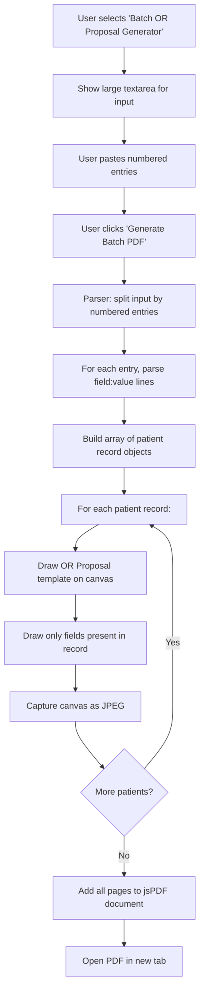

# Batch OR Proposal Generator — Plan

## Overview

Add a new "Batch OR Proposal Generator" to the existing Forms Generator app that takes a numbered list of patient entries and generates a multi-page PDF, with each patient rendered on the OR Proposal template.

---

## 1. Input Format

Each patient entry is numbered (`1.`, `2.`, `3.`), with `Label: Value` lines per field. Entries separated by blank lines.

```
1. Name: Juan Dela Cruz
Age: 45
Sex: M
Impression: Fracture of left radius with displacement
Proposed Operation: Open reduction internal fixation

2. Name: Maria Santos
Age: 28
Sex: F
Impression: Acute appendicitis
Proposed Operation: Laparoscopic appendectomy
Surgeon: Dr. Reyes
```

- Fields are **case-insensitive** during label matching
- Only fields that appear in an entry are rendered (if `Age` is omitted, it's skipped)
- Blank lines separate entries
- Entry numbering is parsed but not required for field mapping

---

## 2. Field Label Mapping

Parser maps input labels to OR Proposal field IDs using flexible matching:

| Input Label | Config Field ID |
|---|---|
| `Department`, `Dept` | `orp_department` |
| `Date` | `orp_date` |
| `Name`, `Patient`, `Patient Name` | `orp_name` |
| `Age` | `orp_age` |
| `Sex`, `Gender` | `orp_sex` |
| `Floor`, `Bed`, `Floor/Bed`, `Floor and Bed` | `orp_floor_bed` |
| `Impression`, `Diagnosis` | `orp_impression` |
| `Proposed Operation`, `Operation`, `Surgery` | `orp_proposed_operation` |
| `Date and Time of Surgery`, `Surgery Date` | `orp_date_and_time` |
| `Estimated Time`, `Est Time`, `Est. Time of Surgery` | `orp_est_time_surgery` |
| `Surgeon` | `orp_surgeon` |
| `Asst Surgeon`, `Assistant Surgeon` | `orp_asstsurgeon` |
| `Anesthesiologist`, `Anesthesia` | `orp_anesthesiologist` |
| `Position`, `Position during Surgery` | `orp_position_during_surgery` |
| `Instruments`, `Instrument` | `orp_instruments` |
| `Department Head`, `Dept Head` | `orp_dept_head` |
| `OR Manager`, `Manager` | `orp_or_manager` |

Each input label is matched by checking if the label text (lowercased, trimmed) **starts with or contains** any of the trigger words. This allows flexible input like `Surgeon: Dr. Reyes` or `Asst Surgeon: Dr. Tan`.

---

## 3. Architecture & Data Flow



---

## 4. Implementation Steps

### Step 4.1 — Add config entry in forms-config.js

Add a new entry `orproposal-batch` to `FORMS_CONFIG`:

```js
orproposal_batch: {
  name: "Batch OR Proposal Generator",
  template: "orproposal.png",
  canvasWidth: 2480,
  canvasHeight: 3508,
  pdfOrientation: "p",
  pdfUnit: "pt",
  pdfFormat: "a4",
  sections: [] // no individual fields; handled by batch logic
}
```

This ensures the template is loaded and canvas size is set, but no individual form fields are rendered.

### Step 4.2 — Update selectForm() in index.html

When `orproposal_batch` is selected:
- Hide the form fields grid (`formFieldsContainer`)
- Show a batch input container (`#batchInputContainer`) containing:
  - A large `<textarea>` (placeholder: "Paste patient entries here...")
  - A `Generate Batch PDF` button
  - Preview canvas (same as before)

When any other form is selected:
- Hide batch input container
- Show normal form fields

### Step 4.3 — Build the Parser (new function: parseBatchInput())

```js
function parseBatchInput(text) {
  // 1. Split by entry number pattern: /^\d+\.\s*/m
  // 2. For each entry, parse field:value lines
  // 3. Map labels to field IDs using the label map
  // 4. Return array of { fieldId: value } objects
}
```

Logic:
- Split text on `\n` (newlines)
- Detect entry start: line matches `/^\d+\.\s*/`
- For lines after the number, split on first `:` — left side is the label, right is the value
- Look up label in the mapping table (case-insensitive substring match)
- If no match, skip the line
- Return array of objects like `{ orp_name: "Juan Dela Cruz", orp_age: "45", ... }`

### Step 4.4 — Build the Batch PDF Generator (new function: generateBatchPDF())

```js
function generateBatchPDF() {
  const text = document.getElementById('batchInput').value;
  const records = parseBatchInput(text);
  
  const { jsPDF } = window.jspdf;
  const pdf = new jsPDF('p', 'pt', 'a4');
  
  img.onload = () => {
    records.forEach((record, index) => {
      if (index > 0) pdf.addPage();
      
      // Draw template on canvas
      ctx.clearRect(0, 0, canvas.width, canvas.height);
      ctx.drawImage(img, 0, 0, canvas.width, canvas.height);
      
      // Draw fields from record using same logic as updatePreview()
      drawFieldsOnCanvas(record);
      
      // Capture to PDF
      const imgData = canvas.toDataURL('image/jpeg', 0.95);
      pdf.addImage(imgData, 'JPEG', 0, 0, pageWidth, pageHeight);
    });
    
    const pdfBlob = pdf.output('blob');
    window.open(URL.createObjectURL(pdfBlob), '_blank');
  };
}
```

Reuse the multiline rendering logic from `updatePreview()` by extracting it into a helper function `drawField(field, value)` that draws individual field values onto the canvas using the same font, x/y, maxWidth, lineHeight, etc. from the OR proposal config.

### Step 4.5 — Extract drawField() helper from updatePreview()

Refactor `updatePreview()` so the multiline word-wrapping and rendering logic is reusable:

```js
function drawField(ctx, field, value) {
  if (!value) return;
  ctx.font = field.font || "28px 'RobotoMono', monospace";
  // ... existing multiline/plain text rendering ...
}
```

This will be used by both `updatePreview()` (for single form) and `generateBatchPDF()` (for batch).

### Step 4.6 — Add CSS for batch input container

```css
#batchInputContainer textarea {
  width: 100%;
  height: 500px;
  font-family: 'Iosevka', monospace;
  font-size: 14px;
  padding: 12px;
  border: 1px solid #ccc;
  border-radius: 4px;
  resize: vertical;
}
```

---

## 5. Files to Modify

| File | Changes |
|---|---|
| [`forms-config.js`](forms-config.js) | Add `orproposal_batch` config entry |
| [`index.html`](index.html) | Add batch input HTML, parser function, batch PDF generator, CSS styles, refactor drawing logic |

---

## 6. Edge Cases & Considerations

| Scenario | Handling |
|---|---|
| No entries parsed | Show alert "No valid patient entries found" |
| Entry has no recognized fields | Skip that entry, show warning |
| Empty input | Alert user to paste data first |
| `img` not loaded yet | Wait for `img.onload` before generating (template image must be cached) |
| Very long Impression/Operation text | Already handled by `isMultiline` + `maxWidth` + `lineHeight` rendering |
| Page breaks mid-field | Not required — each patient fits on one A4 page (template is designed for single page) |
| Field label typo | Parser uses substring matching, so `Surgen: Dr. X` **won't** match `Surgeon`. Consider fuzzy matching? |
| Field label extra spaces | Trim label before matching |
| `Name:` vs `Name of Patient:` | Mapping table includes multiple variants per field |

---

## 7. Future Enhancements (Out of Scope)

- Drag-and-drop CSV/Excel import
- Progress bar for large batches
- Preview of each parsed patient before generation
- Editing parsed records before PDF generation
- Fuzzy label matching for typos
