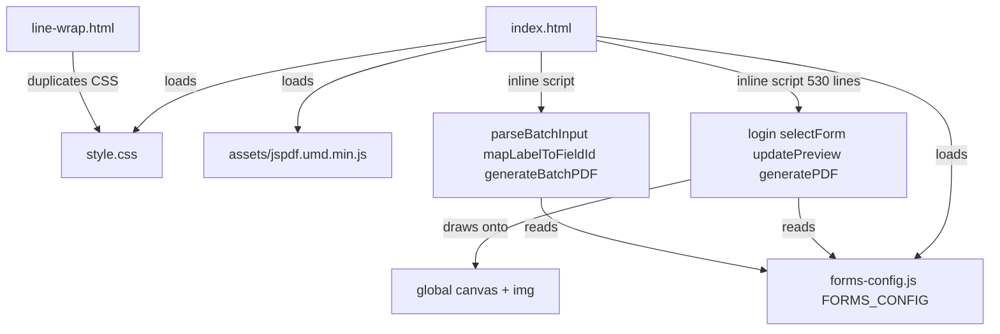
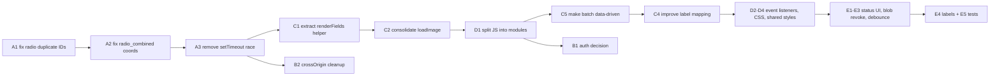

# Code Review: Maintainability & Correctness Improvements

> Status: Documentation only. No code changes made yet.
> Scope: `index.html`, `forms-config.js`, `style.css`, `line-wrap.html`
> Reviewer mode: Architect

## 1. Summary

The project is a client-side, single-page "Forms Generator" that draws user input onto
pre-rendered template images via `<canvas>` and exports a PDF with jsPDF. The architecture
is data-driven (a `FORMS_CONFIG` object describes each form's fields and pixel coordinates),
which is a good foundation. However, the implementation has accumulated correctness bugs,
duplicated logic, and global-scope inline scripting that hurt maintainability.

This document catalogs the issues and proposes an ordered, actionable roadmap. It is meant
to be consumed by another mode (e.g. Code) to implement incrementally.

## 2. Current Architecture (as-is)



Key structural facts:
- All application logic lives inline in `index.html` ([`index.html`](index.html:101)).
- `FORMS_CONFIG` is a single global object ([`forms-config.js`](forms-config.js:1)).
- The batch OR-proposal feature is special-cased rather than data-driven.

## 3. Findings (by severity)

### A. Correctness Bugs (fix first)

- **A1. Duplicate DOM element IDs in `radio` form.**
  [`forms-config.js`](forms-config.js:499) defines two sections with identical field `id`s
  (`hosp-no1`, `date1`, `name1`, …). [`selectForm`](index.html:182) creates duplicate IDs;
  [`updatePreview`](index.html:314) uses `getElementById`, which returns only the first.
  The bottom half of the `radio` form is non-functional in preview and PDF.
  *Decision needed:* is the bottom half a second patient or a carbon copy? Fix by giving
  bottom-half fields distinct IDs (e.g. `hosp-no2`) with their own coordinates, or by
  restructuring into a repeated-patient model.

- **A2. `radio_combined` pages 2 & 3 reuse page-1 coordinates.**
  [`forms-config.js`](forms-config.js:990) lists three `pages` with different templates
  (`radiorequest.png`, `radioctscan.png`, `idrformat2026.png`) but identical `x`/`y`.
  Text will be misplaced on pages 2 and 3. This is incomplete placeholder work.

- **A3. `setTimeout(..., 100)` race in `generatePDF`.**
  [`index.html`](index.html:357) delays capture by a fixed 100 ms. On slow devices the
  canvas may not be ready, producing blank/partial PDFs. Replace with an explicit
  render-complete promise/callback.

### B. Security

- **B1. Hardcoded password `=== '1'`.** [`index.html`](index.html:109) — client-side
  "auth" is cosmetic and trivially bypassable. Either remove the gate or move it server-side.
- **B2. `crossOrigin = "Anonymous"` on same-origin images.**
  [`index.html`](index.html:236), [`index.html`](index.html:373) — unnecessary and can taint
  the canvas under `file://`, breaking `toDataURL`.

### C. Maintainability / DRY

- **C1. `drawField` logic reimplemented 3×:** [`updatePreview`](index.html:312),
  [`renderPage`](index.html:397), [`generateBatchPDF`](index.html:612). Extract one
  `renderFields(ctx, fields, getValue)` helper.
- **C2. `loadImage` defined twice** with different error semantics:
  [`index.html`](index.html:370) (resolves `null`) vs [`index.html`](index.html:584)
  (rejects). Consolidate into one utility.
- **C3. `forms-config.js` is ~1050 lines of repetitive coordinate data.** The `radio` form
  and `radio_combined` `sections` duplicate the same 14 fields; the `pages` array triples
  them. Consider generating shared field sets or a base + override pattern.
- **C4. `BATCH_LABEL_MAP` fragile ordered keyword matcher.**
  [`index.html`](index.html:456) Correctness depends on array order (`dept` vs `dept-head`,
  `date` vs `surgery-date`). Hard to extend, untested. Consider explicit label aliases or a
  small parser with priority scoring.
- **C5. Batch feature special-cased.** `formKey === 'orproposal_batch'`
  ([`index.html`](index.html:141)) plus silent dependency on `FORMS_CONFIG['orproposal']`
  IDs ([`index.html`](index.html:478)) creates implicit coupling. Make batch a first-class,
  data-driven config entry.

### D. Structure / Architecture

- **D1. All app JS inline in `index.html`.** [`index.html`](index.html:101) — no modules,
  global scope. Split into `app.js` (or ES modules) for testability.
- **D2. Inline `onclick`/`onchange` handlers** ([`index.html`](index.html:21),
  [`index.html`](index.html:33)) — use `addEventListener`.
- **D3. Inline styles in HTML** ([`index.html`](index.html:16), [`index.html`](index.html:31))
  — move to CSS classes.
- **D4. `line-wrap.html` duplicates CSS** from [`style.css`](style.css:1)
  ([`line-wrap.html`](line-wrap.html:8)) — share a stylesheet.

### E. UX / Robustness

- **E1. `alert()` for errors** ([`index.html`](index.html:425), [`index.html`](index.html:446))
  — blocking. Use an in-page status region.
- **E2. `window.open(blobUrl)`** ([`index.html`](index.html:431)) can be blocked by popups;
  blob URL never revoked (leak). Revoke after use or trigger a download.
- **E3. No debounce on `updatePreview`** — redraws full 3508x2480 template per keystroke.
- **E4. Config `label` field unused** — no `<label for>` association in
  [`selectForm`](index.html:201); dead data + accessibility gap.
- **E5. No tests** for the parser despite its fragility.

### F. Minor

- **F1.** `setNow` 2-digit year ([`index.html`](index.html:330)) — likely intentional; add a comment.
- **F2.** `orproposal_batch` keeps no-op `sections: []` ([`forms-config.js`](forms-config.js:489))
  only to appear in the selector — indicates selector/model coupling needs redesign.

## 3.1 How to add a page-unique field to `radio_combined` (pattern note)

A question arose: *if a page has its own unique field, can it be added to the `sections`
block above?* Answer: **yes, with a required companion edit.**

### Why it works the way it does

The `radio_combined` config splits responsibility in two ([`forms-config.js`](forms-config.js:819)):

- **`sections`** ([`forms-config.js`](forms-config.js:828)) is the **UI + live-preview schema**.
  [`selectForm`](index.html:163) creates one input per field in `sections`, and
  [`updatePreview`](index.html:312) draws each of those fields on the preview canvas using the
  `x`/`y` stored in `sections`.
- **`pages[].fields`** ([`forms-config.js`](forms-config.js:990)) is the **per-page PDF schema**.
  [`generatePDF`](index.html:408) → [`renderPage`](index.html:384) draws only the fields listed
  in each page's `fields`, looking up the value via `document.getElementById(field.id)`.

A field reaches the PDF **only if it is listed in that page's `fields`**, independent of `sections`.

### Steps to add a page-unique field

1. Add the field to `sections` with a **unique `id`** (so the input and preview exist).
2. Also add the same `id` to the **specific page's `fields`** array that should print it,
   with that template's correct `x`/`y`/`font`. If omitted there, the user can type it but it
   never appears in the PDF (silent gap).

Illustrative (not applied):

```js
// sections (input + preview):
{ id: "ct_findings1", label: "CT Findings", type: "textarea",
  x: 450, y: 1400, font: "36px 'Iosevka', monospace",
  isMultiline: true, maxWidth: 1600, lineHeight: 36 }

// pages[1].fields (radioctscan.png) so it prints on page 2:
{ id: "ct_findings1", x: 450, y: 1400, font: "36px 'Iosevka', monospace",
  isMultiline: true, maxWidth: 1600, lineHeight: 36 }
```

### Caveat

Because `sections` is the shared UI, a page-unique field still shows as a single form input,
and the **preview** draws it at the `sections` coordinates (page-1 layout). If that position
overlaps page-1's template, the preview looks messy even though page-1's PDF won't include it
(since it is absent from `pages[0].fields`). The preview is only a guide, so this is usually
acceptable — but it is a known rough edge of the current design.

### Cleaner alternative (refactor, not a quick edit)

The fragility stems from `sections` doubling as both "UI schema" and "page-1 coordinate source."
A more maintainable structure lets **each page declare its own fields**, and builds the UI from
the *union* of all pages' field IDs. This also removes the current 3× duplication of the same 14
fields inside `pages`. Tracked as items C3/C5 in the roadmap below.

## 4. Proposed Roadmap (actionable steps)

Ordered by dependency and risk. Each step is independently shippable.



### Todo list

- [ ] **A1** Resolve `radio` form duplicate IDs: decide second-patient vs carbon-copy model;
      assign unique IDs + coordinates to the bottom half; verify preview and PDF render both halves.
- [ ] **A2** Correct `radio_combined` page 2 (`radioctscan.png`) and page 3
      (`idrformat2026.png`) coordinates so text aligns to each real template.
- [ ] **A3** Replace `setTimeout(..., 100)` in `generatePDF` with an explicit
      render-complete promise before `toDataURL`/`addImage`.
- [ ] **C1** Extract a single `renderFields(ctx, fields, getValue)` used by `updatePreview`,
      `renderPage`, and `generateBatchPDF`; delete the duplicated loops.
- [ ] **C2** Consolidate the two `loadImage` implementations into one utility with a clear,
      consistent error policy.
- [ ] **D1** Move inline script out of `index.html` into a separate `app.js` (or ES modules);
      remove global-scope pollution; keep `FORMS_CONFIG` as the data module.
- [ ] **C5** Make the batch OR-proposal feature data-driven: define it as a normal config entry
      instead of special-casing `formKey === 'orproposal_batch'` and coupling to `orproposal` IDs.
- [ ] **C4** Improve `BATCH_LABEL_MAP`: replace fragile ordered `startsWith`/`includes` matching
      with explicit label aliases or a priority-scored matcher; add tests.
- [ ] **D2** Replace inline `onclick`/`onchange` handlers with `addEventListener` bindings.
- [ ] **D3** Move inline HTML styles into CSS classes in `style.css`.
- [ ] **D4** Share CSS between `index.html` and `line-wrap.html` (single stylesheet).
- [ ] **E1** Replace `alert()` error paths with an in-page status/error region.
- [ ] **E2** Revoke blob URLs after PDF open (or trigger a download) to avoid leaks/popup blocks.
- [ ] **E3** Debounce `updatePreview` to avoid full-canvas redraw on every keystroke.
- [ ] **E4** Use config `label` to render real `<label for>` associations (accessibility).
- [ ] **E5** Add unit tests for `parseBatchInput` and `mapLabelToFieldId`.
- [ ] **B2** Remove unnecessary `crossOrigin = "Anonymous"` on same-origin template images.
- [ ] **B1** Decide on auth: remove the cosmetic gate or move it server-side (document decision).
- [ ] **F1/F2** Add a comment for 2-digit year; redesign selector so no-op config entries are unneeded.
- [ ] **3.1** Document the page-unique-field pattern (added above) so future form edits follow it.

## 5. Notes for the implementing mode

- Steps A1, A2, A3 are bug fixes and should be verified against the actual template PNGs
  (coordinates must be measured against each image).
- C1/C2/D1 are pure refactors with no behavior change and unblock the rest.
- C5/C4 change the batch feature's structure; keep `parseBatchInput` behavior identical unless
  a test proves the current mapping is wrong.
- Prefer small, reviewable commits per todo item.
- When extending `radio_combined` with page-specific fields, follow the pattern in section 3.1
  (add to `sections` for the input/preview AND to the target `pages[].fields` for PDF output).
