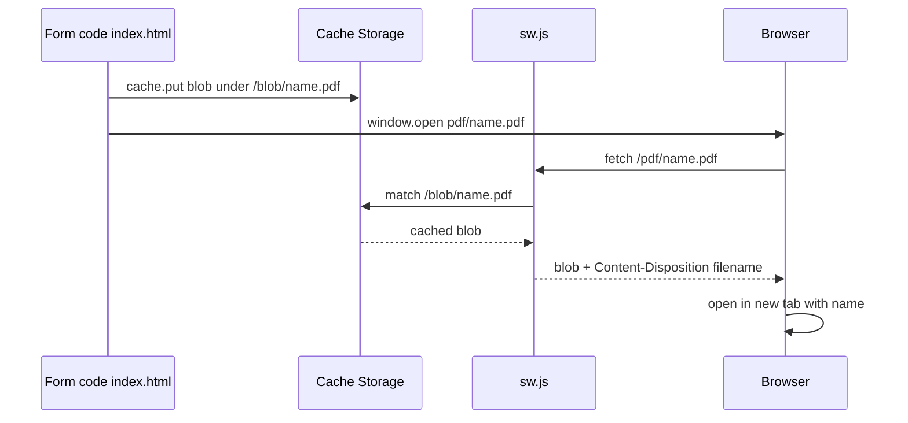

# Predictable PDF Filenames via Service Worker

## Goal

Give generated PDFs a predictable, human-readable filename while **keeping** the current "open in a new tab" behavior. The site is static and hosted on GitHub Pages (HTTPS), so a Service Worker is a viable and appropriate solution.

## Background / Why a Service Worker

A `blob:` URL (from `URL.createObjectURL`) carries no meaningful filename, and the browser derives the name shown in the PDF viewer from either:

1. The URL path, or
2. The `Content-Disposition` response header.

A `blob:` URL provides neither. Setting the PDF's internal `/Title` metadata does **not** help — browsers ignore it for the display/save filename.

The standard fix for a static site is a Service Worker that:

- Stores the generated PDF blob in Cache Storage under a stable key.
- Intercepts a friendly URL like `/pdf/<name>.pdf`.
- Responds with the blob plus `Content-Disposition: inline; filename="<name>.pdf"`.

## Current state

Three locations in [`index.html`](index.html) generate a PDF and open a raw blob URL:

- Line 431 — multi-page form (`generatePDF`)
- Line 442 — single-page form (`generatePDF`)
- Line 626 — batch OR Proposal (`generateBatchPDF`)

Each does:

```js
const pdfBlob = pdf.output('blob');
const blobUrl = URL.createObjectURL(pdfBlob);
window.open(blobUrl, '_blank');
```

## Implementation plan

### 1. Add `sw.js` (new file, site root)

A Service Worker that handles `/pdf/<name>.pdf` requests:

```js
const CACHE = 'pdf-blobs';

self.addEventListener('fetch', (event) => {
  const url = new URL(event.request.url);

  // Only handle our synthetic /pdf/... route
  const match = url.pathname.match(/\/pdf\/(.+\.pdf)$/);
  if (!match) return;

  const filename = decodeURIComponent(match[1]);

  event.respondWith(
    caches.open(CACHE).then(async (cache) => {
      const key = `/blob/${filename}`;
      const cached = await cache.match(key);
      if (!cached) {
        return new Response('PDF not found', { status: 404 });
      }
      const blob = await cached.blob();
      return new Response(blob, {
        headers: {
          'Content-Type': 'application/pdf',
          'Content-Disposition': `inline; filename="${filename}"`,
        },
      });
    })
  );
});
```

### 2. Register the Service Worker in [`index.html`](index.html)

Add near the top of the inline `<script>` (after line 101), guarded so it only runs on supported/secure contexts:

```js
if ('serviceWorker' in navigator && location.protocol === 'https:') {
  navigator.serviceWorker.register('sw.js');
}
```

Note: use a relative path so it works under a GitHub Pages project subpath (e.g. `/med-tools/`).

### 3. Add a helper to cache the blob and open the friendly URL

```js
async function openNamedPdf(blob, filename) {
  const cache = await caches.open('pdf-blobs');
  const response = new Response(blob);
  await cache.put(`/blob/${filename}`, response);

  // Open relative to current base so it resolves correctly under a subpath
  if ('serviceWorker' in navigator && navigator.serviceWorker.controller) {
    window.open(`pdf/${filename}`, '_blank');
  } else {
    // Fallback: raw blob URL (no predictable name) until SW is active
    window.open(URL.createObjectURL(blob), '_blank');
  }
}
```

Fallback is important because the Service Worker is not active on the very first load (registration is async); subsequent opens will use the friendly URL.

### 4. Replace the three `output('blob')` blocks

For each of lines 429-431, 440-442, 624-626, replace with a call to `openNamedPdf(pdfBlob, filename)`.

### 5. Build the filename

Add a filename builder that uses the active form name, patient name (where known), and date.

Candidate patient-name field IDs across configs:

- `orp_name` (OR Proposal)
- `name1` (Prescription Pad)

Helper:

```js
function sanitizeFilename(str) {
  return (str || '').replace(/[\\/:*?"<>|#%&{}$!'@+`=]/g, '')
    .replace(/\s+/g, '-')
    .replace(/-+/g, '-')
    .trim();
}

function formatDateCompact(d) {
  const y = d.getFullYear();
  const m = String(d.getMonth() + 1).padStart(2, '0');
  const day = String(d.getDate()).padStart(2, '0');
  return `${y}${m}${day}`; // YYYYMMDD
}

function buildPdfFilename() {
  const config = FORMS_CONFIG[currentFormKey];
  const formName = sanitizeFilename(config && config.name) || 'form';

  let patientName = '';
  const candidates = ['orp_name', 'name1'];
  for (const id of candidates) {
    const el = document.getElementById(id);
    if (el && el.value) {
      patientName = sanitizeFilename(el.value);
      break;
    }
  }

  const dateStr = formatDateCompact(new Date()); // YYYYMMDD
  const parts = [dateStr, patientName, formName].filter(Boolean);
  return `${parts.join('-')}.pdf`;
}
```

For the batch generator, there may be many patients in one PDF, so use a simpler name (date + form, no single patient):

```js
const filename = `${formatDateCompact(new Date())}-OR-Proposal-Batch.pdf`;
```

## Filename format

`YYYYMMDD-patient_name-form.pdf`

## Filename examples

- `20260903-Juan-Dela-Cruz-Prescription-Pad.pdf`
- `20260903-Maria-Santos-OR-Proposal.pdf`
- `20260903-OR-Proposal-Batch.pdf`

## Sequence diagram



## Constraints / caveats

- Requires HTTPS or `localhost` (GitHub Pages provides HTTPS). It will NOT work under `file://`.
- Service Worker is not active on the first load after deploy — the fallback keeps opens working (with a random name) until registration completes.
- Each new PDF with the same filename overwrites the previous cache entry (fine for single-user flow).
- SW cache should be cleared when a new deployment changes `sw.js`; optional `self.skipWaiting()` + cleanup can be added later if needed.

## Files touched

- `sw.js` (new)
- `index.html` (register SW, add helpers, replace 3 blob-open blocks)