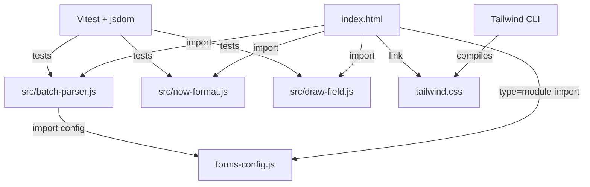

# Plan: Tailwind + DaisyUI Styling + Test Suite

## Goal
1. Replace the hand-written `style.css` with **Tailwind CSS + DaisyUI**, compiled to a **local** `tailwind.css` (no runtime CDN, so it works on restricted hospital networks).
2. Make the core logic **testable** by extracting it into ES modules and adding a **Vitest + jsdom** test suite.
3. **Remove the line-wrap page** (`line-wrap.html`) and its link from `index.html`.

## Approach Overview
- Keep the site **static** (no app build step for deployment). Tailwind/DaisyUI are compiled to one CSS file via the Tailwind CLI and committed to the repo.
- Convert the browser code to **ES modules** so both the browser and Vitest can import the same logic.
- Extract the "brain" functions out of `index.html`'s inline `<script>` into `src/` modules.
- Write unit tests for the pure logic (parsing, formatting, canvas drawing with a mock context).

## 1. Project Tooling
Add a `package.json` (no app bundler, just dev tooling):
- `devDependencies`: `tailwindcss`, `daisyui`, `vitest`, `jsdom`
- `scripts`:
  - `"build:css": "npx @tailwindcss/cli -i ./src/input.css -o ./tailwind.css --minify"`
  - `"test": "vitest run"`
  - `"test:watch": "vitest"`

`tailwind.config.js`:
- `content: ["./index.html", "./forms-config.js", "./src/**/*.js"]`
- `plugins: [require("daisyui")]`
- `daisyui` theme config (optional; keep default or add a medical-ish accent)
- `safelist`: any classes composed dynamically in JS (e.g. field `class: "small"` mapped to a Tailwind class) so Tailwind doesn't purge them.

`src/input.css`:
```css
@import "daisyui";
@tailwind base;
@tailwind components;
@tailwind utilities;
/* keep @font-face for Iosevka / RobotoMono here, plus #pdfCanvas rules */
```

## 2. Compile Local CSS (no runtime CDN)
- Run `npm run build:css` once; commit the generated `tailwind.css`.
- In `index.html`, replace `<link rel="stylesheet" href="style.css">` with `<link rel="stylesheet" href="tailwind.css">`.
- Re-run `build:css` whenever new Tailwind classes are added (Tailwind only ships classes it finds in scanned files).

## 3. Convert `forms-config.js` to an ES Module
- Change `const FORMS_CONFIG = { ... }` to `export const FORMS_CONFIG = { ... }`.
- In `index.html`, load it as a module: `<script type="module">` that `import { FORMS_CONFIG } from './forms-config.js'`.
- Note: ES modules require serving over http(s) (GitHub Pages is fine; for local preview use VS Code Live Server or `npx serve`). `file://` will not work for module imports.

## 4. Extract Pure Logic into `src/` Modules
Create these modules (each exporting pure/testable functions):

- `src/batch-parser.js`
  - `parseBatchInput(text)` — split into records with global fallbacks
  - `parseFieldLine(line, record)` — `label: value` parsing
  - `mapLabelToFieldId(label)` — keyword → fieldId mapping (move `BATCH_LABEL_MAP` here)
  - `getOrpFieldMap(config)` — build fieldId → field def map

- `src/now-format.js`
  - `formatNow(date, mode)` — pure date/datetime formatter (inject `Date` so tests are deterministic)

- `src/draw-field.js`
  - `drawField(ctx, field, value, defaultFont)` — canvas text drawing; takes a `ctx` so tests can pass a mock with `measureText`/`fillText` spies

Keep `updatePreview`, `generatePDF`, `selectForm`, `login`, and DOM rendering inline in `index.html` (they need the real DOM/canvas), but have them `import` from the modules above.

## 5. Remove the Line-Wrap Page
- Delete `line-wrap.html`.
- In `index.html`, remove the "Line Wrap Tool" link (currently near the bottom, `<a href="line-wrap.html">`).
- Do **not** create a `line-wrap.js` module or a `wrapText` test — that logic is no longer needed.

## 6. Styling Migration (Tailwind + DaisyUI)
Replace custom CSS with utility/component classes in `index.html`:
- Login screen → `card` / `card-body` centered layout
- Form selector `<select>` → DaisyUI `select select-bordered`
- Inputs → `input input-bordered` (+ `input-sm` for `class:"small"`)
- Textareas → `textarea textarea-bordered`
- "Now" buttons → `btn btn-success btn-sm`
- Generate buttons → `btn btn-primary`
- Container / sections / grid → Tailwind flex/grid utilities (`flex flex-col gap-4`, `grid`, etc.)
- Keep `@font-face` and `#pdfCanvas` rules in `style.css` (or `src/input.css`) since they aren't utility-friendly.

## 7. Test Suite (Vitest + jsdom)
`vitest.config.js` with `environment: 'jsdom'`.

Test files in `src/__tests__/` (or `*.test.js`):
- `batch-parser.test.js`
  - Global header vars applied as fallback to each record
  - Multiple numbered entries (`1.` / `1)` / `1) `)
  - `mapLabelToFieldId` keyword matching (case-insensitive, startsWith/includes)
  - Missing/empty lines ignored
- `now-format.test.js`
  - Fixed `Date` → expected `MM/DD/YY` (date mode) and `MM/DD/YY h:mm AM/PM` (datetime mode)
- `draw-field.test.js`
  - Multiline wrapping respects `maxWidth` using a mock `ctx.measureText`
  - `anchorBottom` positions lines upward
  - `padSpaces` prefixes first line
  - Empty value → no `fillText` calls
- `field-map.test.js`
  - `getOrpFieldMap(FORMS_CONFIG.orproposal)` returns all field ids

## 8. Mermaid Diagram



## 9. Files Changed / Created
- **New:** `package.json`, `tailwind.config.js`, `vitest.config.js`, `src/input.css`, `src/batch-parser.js`, `src/now-format.js`, `src/draw-field.js`, `src/__tests__/*.test.js`, `tailwind.css` (generated)
- **Modified:** `index.html` (module script + Tailwind/DaisyUI classes + link; remove line-wrap link), `forms-config.js` (add `export`), `style.css` (trim to fonts + canvas), `README.md` (dev/test/build steps)
- **Deleted:** `line-wrap.html`

## 10. Verification
1. `npm install`
2. `npm run build:css` → confirm `tailwind.css` generated
3. `npm test` → all tests pass
4. Serve locally (`npx serve` or Live Server) → login, switch forms, generate PDF, batch parse all still work with new styling and no line-wrap link.
